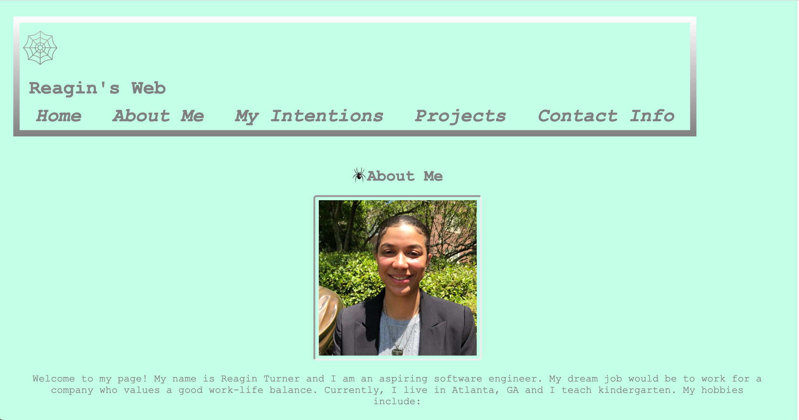

# Reagins-Web
- 09/08/2021

## Description
- My website is aimed towards employers so that they can view my projects, and full stack experience.
- Employers will be able to get a quick introduction and a glimpse into my background.
- Employers will also be able to contact me quickly and easily. 
- Building this website has helped me get a better understanding of HTML and CSS and has given me the perfect opportunity to showcase what I know so far.
- As time goes on, I plan on implementing more features that directly reflect where I am in my learning of Fullstack.

## Installation
- Copy and paste the [link](https://reagintaylor.github.io/Reagins-Web/) in your browser of choice.
- 

## Usage 
- When viewing my website, you can see eveerything clearly.
- When you click on the navigation links, you should de directed to that specific section on the page.
- When you scroll down, the header should be fixed and follow you through the page.
- When you click the images in projects, you are directed to the website.
    * When you open details on a project, you should see a short description and a link to github.
- When you input your information into the contact form, you should be able to submit it.

## Credits
- Special thank you to [Kelsey Perkins](https://github.com/kperkins97/) for helping me with the name of my site and with the beginning stages of mapping out the format of the site.
- I received help from my tutor Dennis Pavyluk also. 